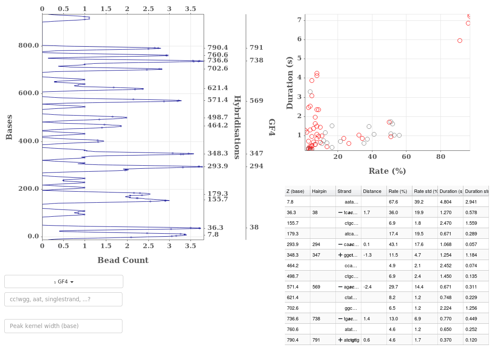

.. include:: ../utils.rst

=========
Consensus
=========

    Displays showing a consensus of all beads attached to a given hairpin as
    well as the current bead. The rates and durations for all *selected* peaks
    are shown on the right plot.

The goal of this tab is to show a consensus on all beads attached to the
current hairpin. If none has been indicated, the tab is of lesser interest.

Creating Consensus Peaks
========================

The consensus is created by aggregating new data with one cycle per selected
bead and one *binding event* per peak and bead. Each *binding event* is
composed of the mean position, in bases, of each binding event in the peak.
Thus, a peak in bead 0 composed of 5 different binding events will result in
one event 5 measures long in cycle 0 of the consensus bead. From these
aggregated *binding events* peaks are found as for a normal bead.

As the consensus data is created using measures in bases, the data between
beads should be aligned unless their stretch and bias were incorrectly computed.

Plots
=====

Two plots are presented:

1. on the left is the peak positions on the y-axis as a function of the number
   of beads in each peak on the x-axis. This is different from the histogram
   reported in the "Cycles & Peaks" tab which show the hybridisation rate. One
   might call it the detection count.

2. on the right is a scatter plot of duration versus rates for all
   hybridisation positions in all beads. The ones in red have no know
   theoretical positions. The ones in gray do.

Graphically selecting positions or values in either plot will display the
relevant values in the other plot.

The Table
=========

The table displays the same information type of information as in the *Peaks*
or *Cycles & Peaks* tab but aggregated over all beads. Thus the *Rate* and
*Duration* columns refer to the mean or the standard deviation of all values
relevant to that position. 
