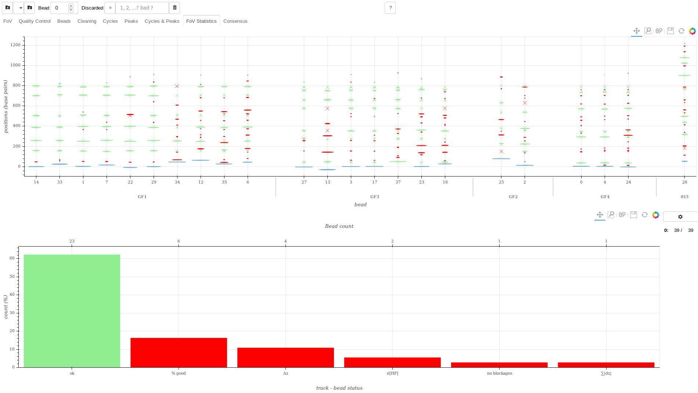
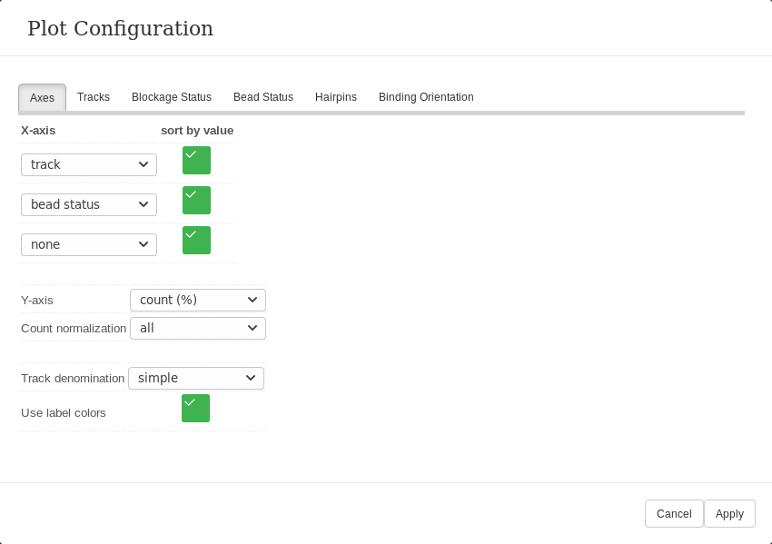

.. include:: ../utils.rst

==========
Statistics
==========

    Displays showing beads across all tracks (top plot) as well as some statistics on said beads (bottom).
    The statistics displayed can be selected throught the *advanced* menu.

The goal of this tab is to provide a global view across all loaded tracks. The
beads are displayed on the top plot. This includes the blockage positions
detected as in the *Peaks* tab as well as hairpin bindinds if these have been
defined. The statistic are displayed on the bottom.

The Plots
=========

Beads Plot
----------

The top display shows all beads attached to selected tracks and hairpins.

The beads are grouped as follows:

1. By hairpins when those have been defined. The order of the hairpin is
   defined using the median quality score of beads, with the best hairpin on
   the left, the worst on the right.
2. By track: if hairpins are defined, the order is again defined using the
   median quality score in the group. Note that the track denomination can be
   changed using the *advanced* menu. In the situation where there is a single
   track, the chosen denomination might remove the track category.
3. By bead number: if hairpins are defined, the order is again defined using the
   quality score.

There are two sets of points:

1. Ovals are for experimental data. The width of the oval is a function of the
   hybridisation rate. The height of the oval is a function of the peak width. Colors are:

   * Blue ovals for *baseline* or *single strand* blockages.
   * Green ovals for *normal* blockages when no hairpins have been provided or
      *identified* blockages when they have. Identification is purely a question
      of distance to a hairpin binding position: this distance of 10 bases can be
      redefined using the *advanced* tab.
   * Red ovals for *non-identified* blockages, i.e. those more than 10 bases away
      from any binding position.

2. Crosses are for hairpin binding positions: theoretical values.

   * Green crosses for bindings which have been identified with a blockages (<
     10 bases): at least one blockage is 10 bases or less away from the binding
     and no other binding is closer to that blockage
   * Red crosses for other bindings.

A number of filters can be applied to beads, blockages or bindings. Using the
*advanced* menu, one can select which tracks to display, which hairpins, beads
as well as the binding strand (or orientation).

Statistics Plot
---------------

The information displayed is either counts are whisker boxes on a given y-axis
parameter as a function of up to 3 x-axis parameters.

The X-Axis
^^^^^^^^^^

For the x-axis, these parameters are:

* *hairpin* is the hairpin to which the bead was affected.
* *closest binding (bp)* is the binding to which a blockage is affected. There
  can be more than one blockage affected to any given binding.
* *binding (bp)* is the binding to which the closest blockage is paired. There
  can be no more than one blockage paired to a binding.
* *strand* is the orientation of the binding to which a blockage is affected.
* *track group* is defined by the user on a per track basis.
* *track* is the file to which a hairpin belongs. The exact file denomination
  can be redefined throught the *advanced* menu.
* *φ₅ saturation* is the percentage of blockage events in a blockage position
  which reaches the end of phase 5 without dropping to the baseline. If the
  values are too high (> 10%), average durations and hybridisation rates for
  blockage positions belows will be biased to lower values.
* *blockage status* is the status of the blockage. It can be:

   * *< baseline* if the blockage is below the detected baseline,
   * *baseline* if the blockage is the detected baseline,
   * *identified* if the blockage is close to a binding position.
   * *unidentified* if the blockage is far from any a binding position.
   * *blockage* occurs when hairpins are unavailable in which case this for
     vanilla blockages.
   * *single strand* if the blockage is considered to be the extent of the
     hairpin before it starts closing.
   * *> single strand* if the blockage is above the detected single strand blockage.

* *bead status* is the status of the bead. Althought categories can be
  redefined by the user, by default, this can be:

   * *ok* if no errors were triggered when treating this bead,
   * *empty* if no vanilla blockages were detected on this bead. This happens
     only if hairpins have been provided.
   * *bug* if a bug occured while processing the bead. Please report the
     situation if this occurs.
   * as well as any of the data cleaning messages one already knows from the
     *Cleaning* tab.

The Y-Axis, per Bead
^^^^^^^^^^^^^^^^^^^^

For the y-axis, the parameters on a per bead base are:

* *count (%)* is either a number of beads or a number of blockages depending on
  the selected x-axis variables. These numbers are normalized differently
  depending on the choice of normalization:
 
   * by default, every value is normalized over the sum total of all values in the plot.
   * if a specific x-axis variable is defined as the normalization, the sum is
     over all values categories in that x-axis variable separately for each
     sub-set of categories from remaining x-axis variables. For example, counts
     by track and hairpins normalized over tracks will show the repartition of
     hairpins per track. Normalized over tracks, it will show, for each hairpin
     independently the variability in molecule attaching to the surface.
   * when sequences and oligos are available, then are displayed the percentage
     for *identified* blockages versus *identified* and *missing*.

* *σ[HF] (bp)* is the high frequency noise per bead. Another parameter is
  available for a high frequency noise per blockage.
* *blockage count* is the number of blockages per bead, excluding those at
  or below the baseline as well as at or above the single strand blockage.
* *identified (% bindings)* is the percentage of binding position with a
  blockage both close-by and closer that binding position than to any other.
* *missing (% bindings)* is the percentage of binding positions with no blockages nearby.
* *unidentified (bp⁻¹)* is the ratio of blockage without binding positions
  nearby over the number of bases in the hairpin.
* *missing (bp⁻¹)* is the ratio of binding positions with no blockages
  nearby over the number of bases in the hairpin.
* *top strand identified (% bindings)* is the same as above but only considering a single orientation.
* *top strand missing (% bindings)*
* *bottom strand identified (% bindings)*
* *bottom strand missing (% bindings)*
* *stretch (bp/µm)* is the stretch factor required to go from base pairs to µm.
* *bias (µm)* is the baseline bias required to fit to the hairpin sequence.
* *strand size (µm)*
* *z (µm)* is the average z position measured on each blockage. Note that
  *missing* blockages have a *z (µm)* value. We use the *missing* status use
  *stretch* and *bias* to estimate it back from the *binding (bp)* position.

The Y-Axis, per Blockage
^^^^^^^^^^^^^^^^^^^^^^^^

For the y-axis, the parameters on a per blockage base are:

* *σ[HF] per blockage (bp)* is the high frequency noise measured using frames
  in each blockage position individually.
* *σ[blockage] (bp)*  is the standard deviation over the average position on
  each blockage event. This is a low frequency noise (≤ cycle duration).
* *hybridisation rate (%)* is the percentage of cycles with blockage events at
  a given blockage position (or peak).
* *binding duration (s)* is the average duration of events within a blockage
  position.
* *Δ(binding - blockage) (bp)* is the distance to the closest binding
  position. Only blockages uniquely paired to a binding a considered.
* *|Δ(binding - blockage)| (bp)* is the absolute distance to the closest binding
  position. Only blockages uniquely paired to a binding a considered.
* *Δ(closest binding - blockage) (bp)* is the distance to the closest binding
  position. A binding can be affected to multiple bindings.
* *|Δ(closest binding - blockage)| (bp)* is the absolute distance to the
  closest binding position. A binding can be affected to multiple bindings.

The Reference Track
^^^^^^^^^^^^^^^^^^^

When varying experimental conditions on a single field of view, it can be
useful to compare values bead per bead or blockage per blockage. In order to do
so, one can define a reference track. In such a case, for each bead (bead
blockage position), the y-axis value for the reference track is subtracted from
the same y-axis variable for the same bead (bead blockage position).

Exporting to xlsx
=================

It's possible to save the data for the statistics plot into an xlsx file.
Press the *save* button above the statistics plot in order to do so.

The xlsx file will contain four sheets:

* *Bead status* provides indications on the status of beads: whether they are
  fixed, or have errors, ...
* *Bead stats* shows statistics per bead.
* *Peak stats* shows statistics per peak. This may contain information already
  present in the *bead stats* sheet. It also contains one line per missing binding position in a bead. The blockage status is then *missing* and the information on that line is relevant to the theoretical sequence binding position rather than an experimental bead blockage position.
* *Tracks* provides with explicit information on how the data was produced, the
  software version, etc ... It's for bookkeeping rather than perusal.

Configuring Computations
========================

It's possible to set a number of settings for all currently loaded tracks.
These settings are available in other tabs and only repeated here for the sake
of simplicity. Note that hairpin sequences can be defined either using a file path or
through a python dictionnary. The format is then:

.. code-block::

   {
      hairpin1: aaaatc,
      hairpin2: aaaatcggg,
      hairpin3: cccaaaatcggg,
   }

For those settings not available here, it's always possible to go back to other
tabs and change the settings for each track independently. Another option is to
define the default settings prior to loading all tracks.

Configurring Plots
==================

    Modal dialog which allows configuring the statistics displayed.

A number of tabs are presented. Some only appear if hairpin sequences are
available.

Axes
----

One can select here:

* categories on the x-axis. A checkbox allows defining wether the category
  order should be lexical (unchecked) or value base (checked).
* *Y-axis* allows selecting the characteristic to display on the y-axis. Note
  that depending on selected x-axis categories, some y-axis options will be
  disabled.
* *Count normalisation* is displayed only if *Counts (%)* is selected for the
  Y-axis. In such a case, the percentage is defined using:

   * *all* categories. Every value is normalized over the sum total of all
     values in the plot. The sum of all values in the plot is 100%.
   * a specific x-axis category. For example, should *hairpin* and *binding
     (bp)* be selected as x-axis variables, with *hairpin* as the
     normalisation, then for each hairpin the sum of displayed percentages
     equals 100%.
   * a specific x-axis variable. The the sum is over all values categories in
     that x-axis variable separately for each sub-set of categories from
     remaining x-axis variables. For example, counts by track and hairpins
     normalized over tracks will show the repartition of hairpins per track:
     for each track, the sum of values over all hairpins is 100%. Normalized
     over tracks, it will show, for each hairpin independently the variability
     in molecule attaching to the surface: for each hairpin, the sum of values
     over all tracks is 100%.
   * *blockage status* is specific to when sequences and oligos were provided.
     In such a case, the percentage is that of *identified* blockages over
     *identified* and *missing*.

* *Track denomination* defines how tracks are labeled:

  * *full* uses the track file name in full, prefixed with the order in which
    tracks were loaded.
  * *number* uses the order in which tracks were loaded.
  * *simple* removes from the track file names all elements in common across
    all tracks. Elements must be separated by an underscore (_) to be
    recognized as such. For example "Test033_acc.trk" and "Test033_ggg.trk"
    will be simplified to "acc" and 'ggg' respectively. These simplified names
    are prefixed with the order in which tracks were loaded.
* *Use label colors* will use colors to distinguish x-axis categories. Only the
  last x-axis category is considered. Not all x-axis categories have colors
  defined.
* *Stretch factor* is the stretch to use if no hairpins are available.

Tracks
------

This tab allows defining:

* the track to use as reference. If such a tracks is defined, that track's
  y-axis values are subtracted from others'.
* the group to which a track may belong.
* whether the track should be displayed at all.
* the beads which should *not* be displayed for a given track.

Blockage Status & Z
-------------------

In this tab:

1. **z (µm) bin width** allows selecting the bin size when aggregating data by
   bead z-values. The central value for each bin is then displayed on the
   *x-axis*.
2. The next line allow filtering the blockage data depending on **z (µm)**
   This filter is applied *prior* to computing statistics.
3. The next lines allow allows redefining the labels for blockage status.

.. note::
   The same label can be applied to multiple blockage states, thus regrouping
   them into a single category.

.. warning::
   As opposed to the **z (bp)** entries in the **Hairpins** tab, **z (µm)**
   entries *do not* account for variability in bead magnetization. In other
   words, one should be better off using the entries in the **Hairpins** tab
   should it be available.

Bead Status
-----------

This tab allows redefining the labels for bead status.

.. note::
   The same label can be applied to multiple bead states, thus regrouping
   them into a single category.

Hairpins
--------

In this tab:

1. **z (bp) bin width** allows selecting the bin size when aggregating data by
   bead z-values. The central value for each bin is then displayed on the
   *x-axis*. 
2. **binding (bp): Δ|blockage - binding| <** allows setting the maximum
   distance from a blockage to a binding positions for the former to be defined
   as an *identified* (true positive) rather than an *un-identified* (false
   positive) position.
3. The next two lines allow filtering the blockage data depending on **z (bp)**
   or **binding (bp)**. This filter is applied *prior* to computing statistics.
4. The next lines allow selecting which hairpins to display.

.. note::
   As opposed to the **z (µm)** entries in the **Blockage** tab, **z (bp)**
   entries *do* account for variability in bead magnetization. In other
   words, one should be better off using the entries in the **Hairpins** tab
   should it be available.

Binding Orientation
-------------------

This tab allows selecting which binding orientations display.

Disk Cache
==========

This allows exploring and setting the disk cache management settings. Disk cache is used
for permanently storing computations for a given field of view *and* settings
(fixed beads, ...). Thus computations from a previous day can be recalled
rather than recomputed, which would be slower.

With/Without Hairpins
---------------------

These tabs contain a list of currently stored computations. The use of two tabs
allows distinguishing which computations were done with hairpins available and
which were'nt. The lists display a checkbox on the *left* and another on the
right.  The *left* allows choosing which computations to view. The checkbox on
the *right* allows deleting the files.

Cache Settings
--------------

The storage is managed using the following criteria:

* *maximum size* is the maximum size of all stored computations. The least used
  computations will be deleted first. Setting a value of 0 Mb will delete the
  permanent storage as well as disable this feature.
* *Expires in* defines the number of days before the computations are removed
  from permanent storage.
* *Reset* can be used to restart computations from scratch for all current
  fields of view.

Note that the application's version number (major & minor numbers only) are
stored as well: computations will occur again should either change. The patch
number will not have such an effect unless decided otherwise by the
data-analysis team.

Automated Computations
======================

The software automatically computes hybridisation positions for all *ok* beads.
It restarts those computations every time a change is made to settings which
could affect these positions. This includes settings in the *Cleaning* tab and
others.

Computations are performed using four cores only. The display refreshes
automatically as more and more beads are completed. Results are cached to the
disk. This means that computations from previous days remain accessible as long
as the settings are exactly the same. This storage is self-managed as indicated
previously.
