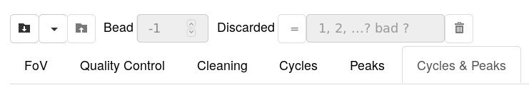

.. include:: ../utils.rst

===============
Getting Started
===============

    The :program:`CycleApp` application.

.. hint::
    The toolbar is also used to display messages to the user:

    * the color *black* indicates a message with no consequences.
    * the color *blue* indicates a message with some consequence. This is for
      example that the current displays will not work because the current bead is
      defective. This is a warning to the user, not a bug.
    * the color *red* indicates an error. This can happen if the user opens a file
      with an unknown format. Often, it's the indication of a bug in the software,
      in particular if the message seems obscure. Please inform your favorite data
      scientist about it!

Opening a file
==============

The leftmost button on the toolbar allows selecting a file to open.

Data files
----------

such files contain the raw data. The software will **never change** the
contents of such a file. Formats are:

* ``.trk``: Track files are raw data files created using any |SIMDEQ|
  instruments. This is the basic type of file that can be opened by the
  software.

* ``.txt``: For micro-wells only! Such files are created by the lock-in
  amplifier.  It expects a specific csv format, including 5 header lines and
  exactly 2 columns, time and voltage respectively. The data is automatically
  synchronized the last loaded track file. See the micro-wells sections.

* ``.gr``: These are data files created using :program:`pias`. They should
  contain a cleaned version of the data for a given bead. To open such
  files, one must first open the ``.trk`` used to created them. This is
  because a lot of information is missing from the ``.gr`` files.

* ``.pk``: These data files are trimed-down version of ``.trk`` files. They
  are mostly created and used by data scientists and developpers. In
  particular, no versionning support is provided, meaning a ``.pk`` file
  created some time ago might not be compatible anymore with up-to-date
  versions of the software. 

.. caution::

    Not all ``.trk`` files can be opened properly. In particular, there must be
    *cycles* and  *phases* registered within the track file. In other words,
    all but those track files created outside the normal way will not open.

.. warning::

    Don't use ``.gr`` files anymore unless it's for reviewing an old project.

Analysis files
--------------

Such files are created throught the software. They contain a *links* to track
files as well as settings for its analysis: a fasta file, the probes used...
Formats are:

    * ``.ana``: a text file containing links to the data and settings values
      which the user has moved away from the defaults.
    * ``.xlsx``: The software allows creating excel reports on a track file. Within
      the reports are the settings used for creating them, just like ``.ana`` file.
      The software can open those reports as it would an ``.ana`` file.

.. caution::

    Analysis files contain links to the raw data. Should the path to the raw
    data change, it will be necessary to update those links. ``.ana`` files
    being text files, this can be done by opening them in :program:`wordpad` or
    any equivalent.

.. hint::

    Other files can be need in other parts of the software, such as ``.fasta``
    files. These have a specific interface for opening them, which will be
    explained in the relevant sections.

Opening multiple files
----------------------

It's possible to open multiple files and switch from one to another using the
button next to the *Open* button. Through there, it's also possible to discard
files that are not needed anymore.

Reference File
^^^^^^^^^^^^^^

Mutiple files might be needed on a single field of view when a series of probes
were tested. In that case, it's possible to state that one of these is the
reference file. See the *Peaks* or the *Cycle & Peaks* tabs.

Saving an Analysis
==================

The software will create either excel reports or analysis files. The latter
contain only links to the data and settings which the user moved from the
default values. The former also contain information on beads: hybridisation
positions, rates and durations, matching, ect...

.. hint::

    Creating a report requires a bit of time. When it's over, :program:`excel`
    or an equivalent is automatically launched, displaying the report.

Navigating through Displays
===========================

Displaying & Discarding beads
-----------------------------

The different display are mostly relevant to a single bead at a time. The
latter can be selected using the input next the the *Save* button. The keyboard
shortcuts :kbd:`PageUp` and :kbd:`PageDown` can also be used to move from one
bead to the next.

Some beads are not worth looking at. The user can discard them from the
analysis as well as reports. This is done by adding their number to the
right-most input in the toolbar.  To discard all bad beads, simply type **bad**
in the same input.  It's also possible to switch from discarding to selecting
by pressing the button (``=`` or ``≠``) to it's left. Finally, the current bead
can be discarded using the shortcut :kbd:`Del`.

The different tabs
------------------

The following tabs are provided:

#. The |FoV|: displays the field of view with the beads and some information on the
   beads.
#. The |QC|: displays quality control information such as temperatures and
   global bead behaviour. This is a good tab to check that an experiment went
   as expected. If a quality control is particularly outside its normal range
   of values, its plot is circled in red.
#. The |Cleaning|: provides means for automatically discarding some beads and
   cleaning the signal from others. This is the starting tab. It's the only one
   to display the *raw* data. This tab allows specifying what a *fixed* and
   *bad* bead are. Such beads will not display in the tabs to the right of the
   |Cleaning|.
#. The |Cycles|: displays the cleaned data for a single bead and allows *manually*
   comparing experimental positions versus hairpin sequences. Only beads
   detected as neither *fixed* nor *bad* will display.
#. The |Peaks|: displays the hybridizations and their characteristics as well as
   allowing to automatically fit the positions to hairpin sequences. Only beads
   detected as neither *fixed* nor *bad* will display.
#. The |CPeaks|: provides the same information as in *Peaks* but with
   different plots. Only beads detected as neither *fixed* nor *bad* will
   display.

Advanced Menus
--------------

Some tabs contain *advanced menus*. These allow configuring options specific to
different projects. For example, the *microrna* project uses very small
hairpins. Their size is consistent with that of a *fixed* bead in a different
project. As such, analyzing its data might require navigating to the *advanced*
menu in the *Cleaning* tab and adjusting the *fixed* bead's maximum height.

Should a user move a setting away from the default value, then the latter is
stored on disk. It will automatically be reloaded the next time the software is
launched. Furthermore, the default value is also added to the display in the
*advanced* menu.

It's possible to tell whether a data file was created by an |SDI| or a
|PICO|. Most settings will come in two version, one for each instrument.
Which settings are used depend on the data file currently on display.

.. hint::

    Default and user settings will change depending on the instrument used to
    create the file currently on display.
