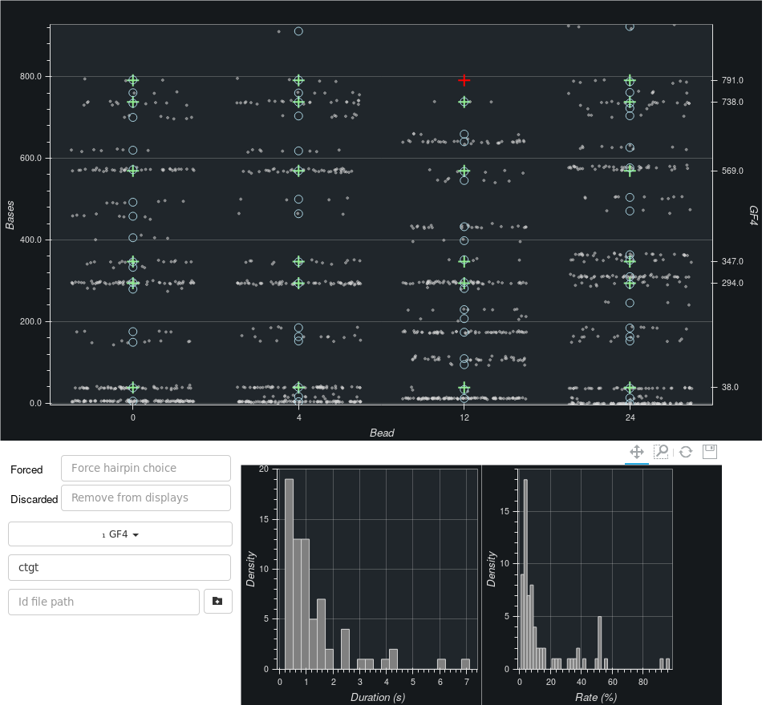

.. include:: ../utils.rst

=============
Hairpin Group
=============

    Displays showing beads attached to a given hairpin as well as the current bead.
    The rates and durations for all *selected* peaks are shown on the bottom plots.

The goal of this tab is to provide a quick look on all beads attached to the
current hairpin. If none has been indicated, the tab is of lesser interest. It
provides with information already shown *selectively* for the current bead in
tab *Peaks*.

The Plots
=========

The display will always show the current bead. It also shows all beads attached
to the currently selected hairpin:

1. A scatter plot shows the hybridisation events (gray circles), the
   hybridisation positions (blue circles) and the hairpin positions (crosses).
   Those hairpin positions for which a hybridisation position has been found
   are indicated in green, the others in red. The current bead is always the
   first on the left.
2. Two histograms show the duration and rate of currently selected
   hybridisation positions. The user can select the positions to use.

Selecting Beads, Hairpins & Oligos
==================================

At the bottom right are a number of inputs allowing to choose which beads are displayed:

1. The *Forced* beads are those beads for which the hairpin is locked.
2. The *Discarded* beads are those beads which will not show on the displays in
   the tab. This only affects this tab.

The remaining inputs are the same as in the *Peaks* tab.

Selecting Hybridisation Positions
=================================

It's possible to select which hybridisation positions to use in both *rate* and
*duration* histograms. This can be done by using the toolbar on top of the
scatter plot by clicking on the icon with a rectangle, then by drawing a
rectangle around the positions to be selected.

Automated Computations
======================

The software automatically computes hybridisation positions for all *ok* beads.
It restarts those computations every time a change is made to settings which
could affect these positions. This includes settings in the *Cleaning* tab and
others.

Computations are performed using two cores only. The display refreshes
automatically as more and more beads are completed.
