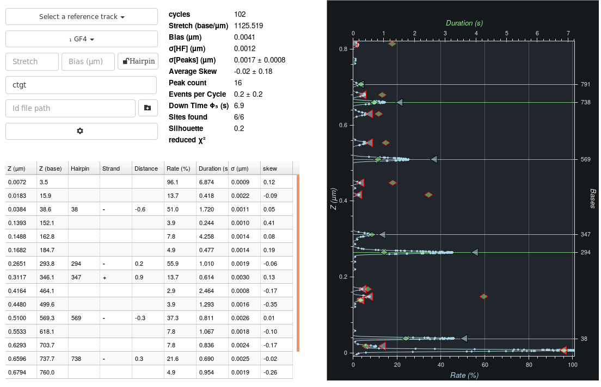

.. include:: ../utils.rst
.. include:: cleaning_utils.rst

=====
Peaks
=====

    The tab shows the peaks detected on a bead as well as their characteristics
    and whether they can be identified with a theoretical position.

    The |CPeaks| shows the same information as in the |Peaks|.

.. hint::

    The |CPeaks| has additional options for configuring the aspect of is plots.
    These are available throught the advanced options.

This tab provides automated extraction of hyridization positions and their
characteristics.  It also allows automatically identifying a bead with a
specific hairpin and its theoretical hybridization positions.

Hairpins and Oligos
===================

See :ref:`hairpins-oligos` in the |Cycles| for details.

The order of preference of the sequences is indicated by a subscripted number.
The sequence which best fits the experimental data is ₁, then ₂, ect...  Some
sequences are preceeded by a `✗`. The latter means that the sequence's length
is either to small or too big considering the bead's |DZ|.  Finally, if a
bead's sequence has been locked-in in the reference track, it is marked as such
when viewing other tracks.

The Reference Track
===================

Often, multiple probes (oligos or antibodies) will be tested on a same field of
view. One test will allow matching a bead within a known list of possible
sequences. Other tests will provide information on the molecule itself, SNPs,
methylations, etc... Even in the case of sequencing, because of the instability
of experimental conditions from test to test, it is required to normalize all
tests versus a single track. This can be done by selecting a *reference track*
in the top drop-down menu.

Selecting a reference track has no effect when viewing that track itself, but for other tracks:

* each bead's |z| values are linearly transformed such that its histogram of
  peaks overlaps as best as possible the reference's. This affects the reports as well.
* the reference track's histogram is displayed in brown on the plot.

For the time being, indicating a reference track is counter productive unless
the reference and other tracks are expected to have a number of peaks in
common. In other words, all other tracks should also have the same *reference
oligos* as the reference track.

Bead and Peak Characteristics
=============================

Bead Characteristics
--------------------

The following *bead* characteristics are reported:

* `cycles` is the number of cycles in the track.
* `stretch` is the stretch factor applied to the peaks:

    * If theoretical binding positions have been provided, this is a conversion
      factor from µm to base count. It should be around 1140 base/µm.
    * If a reference track is provided without theoretical binding positions,
      the conversion factor is only for fitting to the reference track. It
      should be around 1.
    * If both reference track and binding positions are provided, then the
      conversion factor is the product of both.

* `bias` is the bias which must be removed to fit the reference track and/or
  the theoretical binding positions.
* |NOISE| is the high frequency noise detected on the bead.
* :math:`\sigma[Peaks]` is the standard deviation of event positions in a peak,
  averaged over all peaks.
* `Average skew` is the mean skew computed over all peaks. As explained above,
  values can go from -1 to 1 and should remain close to 0.
* `Peaks count` is the number of detected peaks
* `Events per cycle` is the number of events per cycle on all peaks together,
  notwithstanding the baseline peak. It's an indicator of the number of cycles
  *wasted* for lack of any blockings occurring.
* `Baseline (µm)` is the position of the peak expected to be the baseline. The
  latter is the peak closest to the median altitude of the bead at phase 1,
  with at least a 10% hybridisation rate. If listed (add a '0') with the list of oligos,
  this peak will be used to better estimate the bias.
* `Singlestrand (µm)` is the position of the peak expected to be the
  single-strand peak. The latter is estimated as the highest peak such that
  phase 4 ends without any break. If listed (add a '$') with the list of
  oligos, this peak will be used to better estimate the bias.
* `Downtime φ₅ (s)` is the average time remaining in a cycle after all
  blockings notwithstanding the baseline peak are done. It's an indicator of
  the amount of time *wasted* for lack of any blockings occurring.
* `Sites found` is the number of theoretical positions for which an
  experimental peaks was found.
* `Silhouette` is a indicator of how much better the current sequence fits the
  data compared  to other sequences. It reaches 1 for best fits and -1 for the
  worst.
* `Reduced Χ²` is the chi square of the fit of experimental peaks to
  theoretical positions, considering only those experimental peaks with an
  identified theoretical position.

Peak Characteristics
--------------------

The following characteristics are reported in the table of the |Peaks|.

* :math:`z (\mathrm{µm)}` is the mean position of events in the peak in micrometers.
* :math:`z (\mathrm{base)}` is the mean position of events in the peak in base number:
  :math:`z (\mathrm{base}) = \mathrm{stretch} (z (\mathrm{µm}) - \mathrm{bias})`.
* `Hairpin` is the theoretical position assigned to the peak if any.
* `Strand` reports nothing unless theoretical positions are available. If there
  are some, it reports the strand on which the assigned theoretical position
  can be found as well as the sequence around either the theoretical position
  or the experimental position when no theoretical position was found. The
  sequence is marked in bold for bindings on the positive strand and italic
  bold for the negative strand.
* `Distance` is the distance between experimental and theoretical positions, in
  number of bases. 
* `Rate (%)` is the percentage of cycles for which an event was detected for
  that peak.
* `Duration (s)` is the average duration of events in that peak.
* :math:`\sigma (\mathrm{µm})` is the median deviation off all events together.
* `skew` is the skew computed for that peak. This reports how symmetric the
  peak seems to be. Perfect symmetry is achieved at 0. Skews can reach a
  minimum of -1 to a maximum of 1. A skew too far from 0 is a sign that the
  peak is probably two hybridizations positions close together.

Extracting Peaks
================

Peaks are extracted using the hybridization events extracted as specified in
the |Cycles| (:ref:`event-extraction`). They are aggregated as follows:

#. The cycles are re-aligned using event positions. This does improve the cycle
   alignment unless there are too many peaks. In such a case, the new alignment
   might erroneously merge two peaks together. The alignment is done as
   follows:

    #. One histogram of event positions is created for each cycles.
    #. These histograms are summed up.
    #. Each cycle histogram is allowed to move *a little* so as to better
       overlap the sum of histograms.
    #. The process is repeated twice using updated alignments.

#. A histogram of all event positions is created using all *re-aligned* cycles.
#. The histogram's peaks are extracted. If peaks are too close (~ |NOISE|),
   only the highest one is kept.
#. Hybridization events are assumed to belong to the closest peak within a
   maximum range of 5 |NOISE|.
#. Peaks with too few events are rejected.
#. All peaks characteristics are then computed using the events belonging to
   that peaks, including its position.

The histograms themeselves are created by applying a gaussian kernel to the
event positions. The duration of the event is not taken into account, nor it's
intrinsic noise. The kernel size is of 1 |NOISE| for an |SDI| instrument and 2
|NOISE| for a |PICO|.

Fitting to a Sequence
=====================

Fitting experimental peaks to theoretical positions occurs as follows:

#. The single-strand peak is removed from the list of peaks if detected unless:

    * The phase 4 is not a ramp. In that case, the detection algorithm which
      consists in detecting whether the strand closes during that phase cannot
      be applied.

    * The user added the single-strand peak to the list of oligos.

    * The user specifically requested that the single-strand peak detection be
      not performed.

#. If the single-strand peak was added to the list of oligos is detected as
   missing from the experimental data, it is removed from the theoretical peaks
   for that bead only.

#. The baseline peaks is detected. Peaks below it are discarded. It's defined as follows:

    * :math:`z_\mathrm{peak}-z_{\phi_1} < 0.015 \mathrm{\mu m}`: the peaks is
      close to the baseline as measured in phase1.
    * the containing at least 10 events
    * it has the lowest |z| position from amongst all peaks which fit the
      previous filters.

#. |DZ| is computed and compared to the sequence sizes. Those sequences too
   small or too big are discarded for that bead.

#. The remaining sequences are used to fit to the data.

Two algorithms are provided to try to fit experimental peaks to theoretical positions:

#. an exhaustive fit considers every two pair of theoretical positions and
   experimental peaks. For each of those:

    #. it finds an initial stretch and bias using the two pairs.
    #. Using the stretch and bias, it tries to pair up other theoretical
       positions to experimental peaks.
    #. Using all pairs, it finds the best strectch and bias with a linear fit.

#. another type of fit consists in finding the stretch and bias reducing the
   following cost function, where α is the stretch and β is the bias. For this
   fit, multiple initial conditions are tested:

.. math::

    \mathrm{F}(x) = \sum_{x \in \mathrm{peaks}, y \in \mathrm{positions}}
    exp(-\frac{1}{2}(y-\alpha x + \beta)^2/\sigma^2)

When the baseline or the single-strand have been added to
the list oligos, then both the cost function and the chi square fit are
provided with additional terms for every peak either below the baseline or
above the single-strand, discouraging such solutions.

Advanced Options
================

The following settings can be moved by the user. Should that happen, the
default settings will be indicated in parenthesis to the left of the input box.

Cleaning
--------

* |CLIPPING|
* |SUBTRACTION|
* Cycle alignment *prior* to peak extraction
* `Discard the single strand peak (unless in oligos)` allows automatically
  detecting and discarding the single-strand peak unless the user added it to
  the list of oligos.
* `Detect and discard peaks below the baseline` allows discarding peaks below
  the baseline peak.

Peaks
-----

Events in Peaks
^^^^^^^^^^^^^^^
* `Min frame count per hybridisation` is the minimum number of |z| measures per
  hybridization event.
* `Min hybridisations per peak` is the number of events per Hybridization
  position below which it is discarded.
* `Re-align cycles using peaks` should be unchecked if the density of peaks is
  too high (> 1/(3|NOISE|)).

Fitting Algorithm
^^^^^^^^^^^^^^^^^
* `Peak kernel size (blank ⇒ auto)` is the kernel width used to create the
  histogram. This should be higher than |NOISE|. It' currently at 1 |NOISE| for
  the |SDI| and 2 |NOISE| for the |PICO|.
* `Expected stretch (bases per µm)` is the central value in the range of tested
  stretches.
* `Stretch range (bases per µm)` is the range of stretches explored both above
  and below the expected stretch.
* `Bias range (µm)` is the range of biases explored above and below the the
  bias default value. The latter can be the baseline, the single-strand peak or
  zero depending on the list of *oligos* provided.
* `Exhaustive fit algorithm` allows selecting one or the other fit algorithm.
* `Score is affected by false positives` means that the best fit should also
  account for a low number of unidentified peaks. That was *not* the case prior
  to version 6.8

Binding Position Identification
^^^^^^^^^^^^^^^^^^^^^^^^^^^^^^^
* `Max Δ to theoretical peak` sets a threshold on how far an experimental peak
  can be from to theoretical position for identification.
