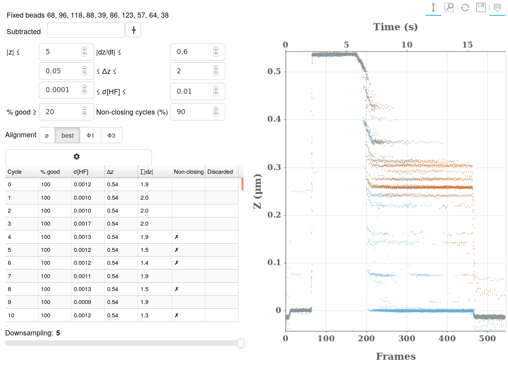

=============
Data Cleaning
=============

    The impact of different signal analysis filters on :math:`z` values for a
    given bead. The color blue is used for accepted frames, other colors
    indicate that the frame or even the whole cycle has been discarded.

The goal of this tab is to:

#. define the setting allowing an automated cleaning of all signals. Beads
   failing this automated cleaning are categorized either as *bad* or
   *missing*.
#. define which beads can be considered *fixed*. Such beads are *probably*
   bound non-specifically to the surface and cannot ever open (become
   single-strand). Their behavior is mostly consistent from bead to bead and
   reflect fluctuations and drifts in the experimental settings, mostly
   temperatures. In effect, they allow measuring the baseline fluctuation of
   the :math:`z` measures.  The baseline fluctuations can thus be removed by
   subtracting these beads'signal from others.

Cleaning Indicators
===================

A Noise Indicator, :math:`\sigma[HF]`
-------------------------------------

This indicator is used throughout the software. It tries to measure the
uncertainty in :math:`z` values without being subject to baseline (low
frequency) fluctuations. This is done by:

#. taking the derivative of the signal, :math:`\frac{dz}{dt} = z(t)-z(t-1)`,
#. for each cycle, measuring the median deviation,
   :math:`\mathrm{median}_{t}(|\mathrm{median}_{t}(\frac{dz}{dt})-\frac{dz}{dt}|)`,
   a robust form of the standard deviation.
#. taking the median of these values over all cycles. This last median means
   that :math:`\sigma[HF]` is not affected by a few missbehaving cycles.

A Size Indicator, :math:`\Delta z`
----------------------------------

The extension is the difference between the initial phase (1) - when magnets
are at 10 pN and beads should be double stranded - and the opening phase (3) -
when magnets are above 18 pN and beads should be single stranded. The exact
formula relies on medians to make the measure more robust to outliers whether
in cycles and frames:

.. math::

    \Delta z = \mathrm{median}_\mathrm{cycles}(
                \mathrm{median}_\mathrm{t \in \phi_3}(z)
                -\mathrm{median}_\mathrm{t \in \phi_1}(z))

Subtracting Fixed Beads
=======================

Beads are defined as fixed if:

#. Their high frequency noise is low, :math:`\sigma[HF] < 6 \mathrm{nm}`.
#. Their extension :math:`\Delta z < 35 \mathrm{nm}`.
#. Their stability from cycle to cycle, measured as defined below must be less
   than :math:`10 \mathrm{nm}`. This stability roughly means that no more than
   10% of measures can lie farther than :math:`10 \mathrm{nm}` away from other
   measures.

Beads detected as fixed are listed in the text above the *fixed bead* input.
They are listed in a prefered order. The user might select 5 from the list and
use them to subtract the baseline signal.

The baseline is measured using all cycles in all selected beads in the
following manner:

#. For each bead and cycle independently, a bias is estimated as the median of
   z values in phase 5.
#. Theses biases are subtracted from each cycle. This means that all *doctored*
   cycles on all beads tend to cross the x axis at the same time in phase 5.
#. For each position :math:`t` in time individually, we estimate the baseline
   position as the median all *doctored* values at that time:

.. math::
    \mathrm{baseline}(t) = \mathrm{median}_{\mathrm{beads}}
    (\mathrm{z}(t, \mathrm{bead})-\mathrm{bias}(\mathrm{cycle}, \mathrm{bead}))

The bias removal means that this reconstructed baseline is not affected by low
frequency fluctuations occurring over more than the timescale of a cycle. Nor
is it affected by each bead having it's own baseline mean. Roughly, all that is
required for the reconstructed baseline to be meaningfull is that at each
cycle more than 50% of beads behave the same way.

Fixed Bead stability
--------------------

As stated above, *fixed beads* should all behave the same way. A similar test
is run over each bead on all cycles. The bead stability is a measure of how
much all cycles in a bead have the same behaviour. Computations are similar to
the reconstruced baseline, but considering a single bead:

#. For cycle independently, a bias is estimated as the median of z values in
   phase 5.
#. Theses biases are subtracted from each cycle. This means that all *doctored*
   cycles on all beads tend to cross the x axis at the same time in phase 5.
#. For each position :math:`t` in time individually, each cycle starting at
   :math:`t=0`, we estimate the varability as the median deviation of all
   *doctored* values. The overall stability is the median deviation of that:

.. math::
    \mathrm{stability}(t) = \mathrm{median deviation}(\mathrm{median deviation}_{\mathrm{cycles}}
    (\mathrm{z}(t, \mathrm{cycle})-\mathrm{bias}(\mathrm{cycle})))

To be quite exact, instead of a median deviation, we use the distance from the
5th to the 95th percentile.

Data Cleaning
=============

A number of filters allow discarding individual z values:

* :math:`|z|`: allows discarding measures too far from the baseline (5 µm by
  default).
* :math:`|\frac{dz}{dt}|`: allows discarding measures too far
  from the measure just before or just after. If a bead jumps up by 3 µm and
  then back down, the measure is discarded.

Most other filters allow discarding badly behaving cycles:

* :math:`\Delta z`: allows discarding that stay closed and beads that have too
  long a strand.
* :math:`\sigma[HF]`: allows discarding noisy cycles or those for which
  measures were not recorded (z is constant).
* `% good`: allows discarding cycles that have too many missing values.
* :math:`\sum |\frac{dz}{dt}|` allows discarding cycles with values which jump
  up and down. This filter's parameters cannot be set by the user.

Finally one filter is performed over all cycles:

* `% non-closing`: requires that a minimum number of cycles close entirely
  before reaching the end of phase 5. This will not always happen either
  because of a structural blockage, which should be detectable using ramps, or
  because of one or more oligos binding too long and too often considering the
  time spent in phase 5.

The bottom-left table displays filter values for all cycles. In particular, the
cycles which have been discarded are marked as such in the right-most column.

Plot Colors
-----------

The plot's :math:`z` values are color-coded as follows:

* Values without problems are blue
* :math:`\sigma[HF]`: noisy cycles are  gold
* :math:`\Delta z`: cycles with an incorrect extent are orange
* Cycles with too few correct values are pink
* :math:`\sum |\frac{dz}{dt}|`: cycles with too few correct values are pink
* Non-closing cycles are chocolate.
* :math:`|z|` and :math:`\frac{dz}{dt}`: outliers are red.

Cycle Alignment
===============

Because of the baseline's variability, cycles need realigning. We use values
from phases 1 and 3 to do so. In theory, using phase 3 should provide us with
best results since this is the phase when the magnets are closest to the beads,
thus when the magnetic gradient is the harshest, and the pull it exerts on the
beads reduces Brownian motion the most. In practice, we find that:

* For some cycles, the hairpin doesn't open, in which case z values in phase 3
  are necessarily small.
* There can be some variability in the bead's full extent, due either to some
  change in the way the oligonucleotide sequence is attached to the surface or
  the bead, or due to secondary structures forming in te sequence.

Empirically, the best cycle alignment is performed by computing the biases per
cycle as follows:

* Default biases are equal the median of phase 3 for each cycle less the median
  extent over all cycles. This *normal* cycles will tend to start at 0 and
  reach the bead's full extent at phase 3.
* For those *corrected* cycles with both phase 1 and the end of phase 5 not
  aligning with other cycles (*i.e.* z ≠ 0), we change their bias to the median
  value in phase 1. Such cycles are those cycles when the bead doesn't open.
* We discard cycles for which values in phase 7 (magnets at 5 pN) are too far
  from others. This filter is loose because phase 7 has a very high Brownian
  motion and values are particularly unstable.

The user can select the alignment described above or others:

#. `∅`: No alignment
#. `best`: the procedure described above.
#. `φ1`: aligning all cycles on phase 1.
#. `φ3`: aligning all cycles on phase 3.

.. hint::

    Downsampling has no effect on data cleaning or alignment. In consists only
    in reducing the number of points displayed in the plot. The latter makes
    displays a little more fluid.
