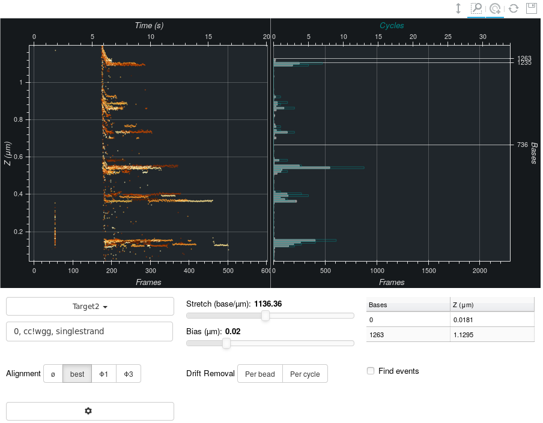

=================
Looking at Cycles
=================

    Two plots providing a rough analysis of the situation for one bead. On the
    left are cycles superposed one on the other. On the right are histograms
    indicating the number of cycles (*rate*) and the number of values
    (*duration*) at a given :math:`z` position.

This tab provides information which will be extracted automatically in either
of the 2 tabs to the left. It exists for historical reasons but also allows
fitting manually to a hairpin sequence. This might be helpful should
automations fail. It's still good practice to report such situations if they
happen too often.

Hairpins and Oligos
===================

Choosing Sequences
------------------

A sequence file can be indicated using the left-most dropdown menu. The files
should in fasta format:

    > sequence 1
    aaattcgaAATTcgaaattcgaaattcg
    attcgaaaTTCGaaattcgaaattcgaa

    > sequence 2
    aaattcgaaattcgaaattcgaaattcg
    attcgaaattcgaaattcgaaattcgaa

In this case, two different sequences were provided. The line starting with `>`
should contain the name of the sequence. The next lines will all be part of the
sequence until the next line starting with `>`. The sequence can be in
uppercase or not. No checks are made on the alphabet although the software will
find peak positions only where letters 'a', 't', 'c' or 'g' or their uppercase
are used. In other words, replacing parts of the sequence by 'NNNN' ensures the
software will not use that part of the sequence without changing the latter's
size. The letter 'u' is not recognized either!

Choosing Oligos
---------------

The text box below allows setting one or more oligos. Multiple oligos should be
separated by comas. The positions found can be on *either* strands.

Complex Expressions
^^^^^^^^^^^^^^^^^^^
The following alphabet is recognized, allowing for more complex expressions:

* k: either g or t
* m: either a or c
* r: either a or g
* y: either c or t
* s: either c or g
* w: either a or t
* b: any but a
* v: any but t
* h: any but g
* d: any but c
* u: t
* n or x or .: any
* !: allows setting the blocking position to the next base, as explained bellow.

Blocking Position in the Oligo
^^^^^^^^^^^^^^^^^^^^^^^^^^^^^^

Positions are at the end of the oligos rather than the start as the former is
where the fork blocks. In other words, given a sequence as follows, oligo TAC
will block at position 110 rather than 108::

                  3'-CAT-5'
    5'-(...)cccatattcGTAtcgtcccat(...)-3'
            :          :
            100        110

Such a behaviour doesn't work for antibodies when, for example, looking for
'CCWGG' positions in which the 'W' is methylated. In that case one can use a
'!' to mark the position to use instead. In the following example, 'cc!wgg'
will find a position at 110::

    5'-(...)cccatatttCCWGGcgtcccat(...)-3'
            :          :
            100        110

Setting Stretch & Bias Values
=============================

The :program:`SIMDEQ` instruments all measure a magnetic bead's altitude. This
usually needs to be transformed to a base count. In :program:`CycleApp`, the
transformation is hypothesized as linear. The *Cycles* tab as well as others
thus use two parameters for conversions:

* The *stretch* is the number of base per µm.
* The *bias* is the altitude *in µm* of the first base, i.e. the bead position
  when the hairpin is fully closed.

Thus conversions are:

.. math::

    n_\mathrm{base} = \mathrm{stretch} (x_\mathrm{µm} - \mathrm{bias})

The *Cycles* tab allows manually moving *stretch* and *bias* values. The plots
are updated to dynamically to reflect those changes.

Finding Hybridization Events
============================

Hybridization events can be displayed using the bottom-right checkbox. These
events are found in the following way, for each cycle, looking at phase 5:

#. the phase 5 is split into flat stretches of values:

    #. Using a threshold on the derivative. It is computed here using 6 points,
       the average of the 3 on the right being subtracted from those on left.
       The threshold itself is a p-value  on the likeliness of a gaussian
       distribution producing such a derivative.

    #. The derivative is not efficient when looking at small events (< 6
       measures). Thus intervals with constantly high derivative values are
       re-tested for flatness using a Χ².

#. The borders of each flat stretch are expanded when measures are deemed
   similar enough to the current population of points in the flat stretch.

#. Neighbouring flat stretches are merged together depending on conditions
   listed below. For each test in turn, the two most likely candidates are
   merged first, after which the same test is run again until no candidates are
   found. The tests are, for two neighbouring flat stretches:

    #. Their means deemed are close enough, using a p-value on heteroscedastic
       gaussian populations.

    #. If 75% or more of both poulations share a same range. This should be
       similar to the previous test a soon as both populations have more
       than 10 points.

    #. If the dynamic ranges are similar one to the other. This is again
       similar to the previous test as soon as populations grow.

These events will be used in subsequent tabs to compute peak positions and
other characteristics.
