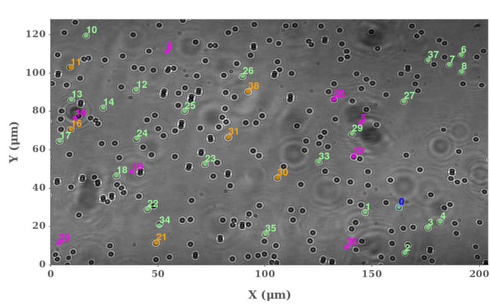

.. include:: utils.rst

=================
The Field of View
=================

Background
==========
 

    Field of view from a |PICO|. Colors indicate the tags attached to a
    bead: *ok*, *fixed*, *bad*, *current*, ...

The field of view tab displays an image of the field of view as well as
information on each bead. The information is shown when when the mouse moves
over a bead.

Colors represent the tags attached to a bead. Such tags, denoting the quality
of a bead, are mostly automatic. They are created depending on settings
available in the *Cleaning* tab:

* *blue* is the current bead. This is not an indicator of quality.
* *pale green* are beads detected as *ok*, neither *fixed* nor *bad* nor
   manually *discarded*. 
* *chocolate* are beads detected as *fixed*. Such beads are good quality but
   are very small. They can be used to remove the baseline component from the
   signal.
* *orange* are beads detected as *bad*. Either their signal is of poor quality
  (|NOISE|) or their extent is off-target or some bindings are too
  strong mask bindings at low |z|.
* *red* are beads manually discarded by the user. This can be done by adding
  their id number to the rightmost input in the toolbar or, for the current
  bead, by pressing :kbd:`Del`.
  disappeared during the experiment.
* *magenta* are beads detected as *missing*. This means the bead was never there or
  disappeared during the experiment.

For each bead, a tooltip is available, displaying further information:

* *pale green* beads display their |NOISE| and their extent.
* other beads display the list of warning leading to their given qualification.

Calibration
===========

Below the field of view, another image is displayed, specific to the current
bead (in blue). It's either:

* for |PICO| data, the calibration image used to track the |z|
  values throughout the current track file.
* for |SDI| data, a blow-up of the bead's neighborhoud.
