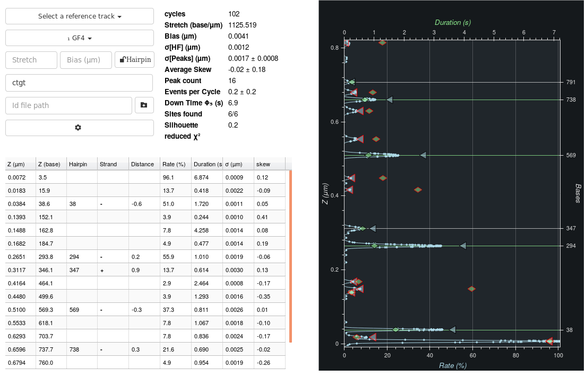

.. include:: utils.rst

=====
Peaks
=====

    The tab shows the peaks detected on a bead as well as their characteristics
    and whether they can be identified with a theoretical position.

This tab provides automated extraction of hyridization positions and their
characteristics.  It also allows automatically identifying a bead with a
specific hairpin and its theoretical hybridization positions.

Hairpins and Oligos
===================

See :ref:`hairpins-oligos` in the |Cycles| for details.

There are some additional information provided by the dropdown menu for
selecting a sequence. Mainly, the order in which the sequences are provided is
indicated by subscripted number (₁, ₂, ...). Some sequences are preceeded by a
`✗`. The latter means that the sequence's length is either to small or too big
considering the bead's |DZ|. Finally, if a bead's sequence has been locked-in
in the reference track, it is marked as such when viewing other tracks.

The Reference Track
===================

Often, multiple probes (oligos or antibodies) will be tested on a same field of
view. One test will allow matching a bead within a known list of possible
sequences. Other tests will provide information on the molecule itself, SNPs,
methylations, etc... Even in the case of sequencing, because of the instability
of experimental conditions from test to test, it is required to normalize all
tests versus a single track. This can be done by selecting a *reference track*
in the top drop-down menu.

Selecting a reference track has no effect when viewing that track itself, but for other tracks:

* each bead's |z| values are linearly transformed such that its histogram of
  peaks overlaps as best as possible the reference's. This affects the reports as well.
* the reference track's histogram is displayed in brown on the plot.

For the time being, indicating a reference track is counter productive unless
the reference and other tracks are expected to have a number of peaks in
common. In other words, all other tracks should also have the same *reference
oligos* as the reference track.

Extracting Peaks
================

Peaks are extracted using the hybridization events extracted as specified in
the |Cycles| (:ref:`event-extraction`). They are aggregated as follows:

#. The cycles are re-aligned using event positions:

    #. One histogram of event positions is created for each cycles.
    #. These histograms are summed up.
    #. Each cycle histogram is allowed to move *a little* so as to better
       overlap the sum of histograms.
    #. The process is repeated twice using updated alignments.

#. A histogram of all event positions is created using all *re-aligned* cycles.
#. The histogram's peaks are extracted. If peaks are too close (~ |NOISE|),
   only the highest one is kept.
#. Hybridization events are assumed to belong to the closest peak within a
   maximum range of 5 |NOISE|.
#. Peaks with too few events are rejected.
#. All peaks characteristics are then computed using the events belonging to
   that peaks, including its position.

The histograms themeselves are created by applying a gaussian kernel to the
event positions. The duration of the event is not taken into account, nor it's
intrinsic noise. The kernel size is of 1 |NOISE| for an |SDI| instrument and 2
|NOISE| for a |PICO|.

Peak Characteristics
====================

The following characteristics are reported in the table of the |Peaks|.

* :math:`z (\mathrm{µm)}` is the mean position of events in the peak in micrometers.
* :math:`z (\mathrm{base)}` is the mean position of events in the peak in base number:
  :math:`z (\mathrm{base}) = \mathrm{stretch} (z (\mathrm{µm}) - \mathrm{bias})`.
* `Hairpin` is the theoretical position assigned to the peak if any.
* `Strand` is the strand on which the probe was bound. This can only be
  reported on peaks for which a hairpin position was found.
* `Distance` is the distance between experimental and theoretical positions, in
  number of bases. 
* `Rate (%)` is the percentage of cycles for which an event was detected for
  that peak.
* `Duration (s)` is the average duration of events in that peak.
* :math:`\sigma (\mathrm{µm})` is the median deviation off all events together.
* `skew` is the skew computed for that peak. This reports how symmetric the
  peak seems to be. Perfect symmetry is achieved at 0. Skews can reach a
  minimum of -1 to a maximum of 1. A skew too far from 0 is a sign that the
  peak is probably two hybridizations positions close together.
