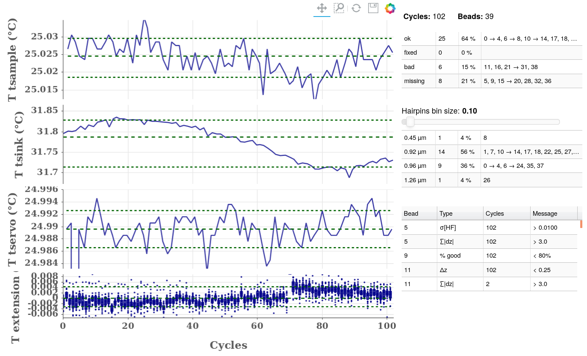

.. include:: utils.rst

===================
The Quality Control
===================
 

    Different plots and tables related to quality control. The top 3 plots on
    the left display temperatures. The bottom plot displays the variability in
    bead extension. The top table shows the number of *ok*, *bad*, ... etc
    beads.  The middle table shows a quick representation *ok* bead extensions.
    The bottom table is a list of warnings issued on all beads.

The goal of every plot it to verify whether the experimental conditions have
remained stable enough throughout the experiment. In order to visualize this,
horizontal lines are added to each plot, indicting the median as well as the
1st and 3rd quartiles over all values in that plot. Plots with too big a
distance from the 1st decile to the 9th are outlined in red. This threshold
distance is :math:`0.3 °C` for temperatures and :math:`3 nm` for bead extensions.

Temperatures
============

The first three plots show temperatures as a function of cycles. Should
temperatures change during an experiment, both the bead extension and in fact
all |z| values as well a hybridization rates and durations will be
affected. The temperatures are:

#. Sample temperature on the topmost plot. The sensor is placed right on top of
   the flowcell. On |PICO| instruments in particular, it can be seen to
   fluctuate periodically as function of the magnet position. This temperature
   in particular should remain as stable as possible.

#. Sink temperature on the middle plot. The sensor is placed on the slab
   holding the instrument. This slab is where the *Peltiers* which cool the
   instrument dump their excess heat. The higher this temperature, the more
   difficult, or even impossible, the job is for the *Peltiers*.

#. Servo temperature on the bottom third. The sensor is next to the *Peltiers*.
   In a |PICO| instrument, this temperature should be extremely stable
   since it's the one directly regulated by the *Peltiers*. An |SDI|
   instrument's temperature is also slaved to the sample temperature but at a
   much slowser rate. The effect should be to allow the servo temperature to
   drift in order to stabilize the sample's.

.. caution::

    Should the temperatures fluctuate or drift away more than :math:`0.3 °C`
    during the experiment, their plot will be outlined in red. Such a change in
    temperature affects the behaviour of probes but also change the extension
    of a bead, increasing the uncertainty on hybridization positions.

Bead Extensions
===============

This indicator, displayed on the very bottom plot, is constructed using all
*ok* beads. That's the ones which are not filtered out through the *Cleaning*
tab. It attemps to measure directly whether bead extensions, thus the |z|
values, thus hybridization positions are stable throughout all cycles or not.
Should this indicator move by more than :math:`3 nm`, then the plot is outlined
in red.

The indicator is constructed as follows:

#. For each bead:

   #. For each cycle, the extension |DZ| is measured as the
         difference between the median positions in phase 1 (initial phase with
         magnets pulling at :math:`10 pN`) and phase 3 (opening phase with
         magnets pulling at :math:`>18 pN`).
   #. These extensions will vary from bead to bead depending on the bead
         magnetization and the sequence size. Thus to compare them across all
         beads requires removing a bias, different for each bead. The latter is
         estimated, individually for each bead, as the median |DZ|
         across all cycles.

#. The resulting normalized extension variations are aggregated across all
   beads for each cycle:

    * Boxes extend from the 1st to the 3rd quartile in each cycle.
    * Outlying values are indicated by a dot.

.. caution::

    Should the extensions fluctuate or drift away more than :math:`3 nm` during
    the experiment, the plot will be outlined in red. Such a change increases
    the uncertainty on hybridization positions.

Categorizing Beads
==================

Bead Quality
------------

Using settings defined in the *Cleaning* tab, beads can be defined as:

* *bad* if any of the following conditions are met for a majority of cycles:

  * the bead extension |DZ| is either too low or too high.
  * the noise from frame to frame (|NOISE|) is too high.
  * the bead doesn't close, meaning |z| in phase 5 doesn't reach |z| in phase 1.

* *missing* if the bead disappeared prior or during the experiment. This is
  measured by considering one or more of the conditions listed above.

* *fixed* if these conditions were not met, yet the bead extension is still too
  low. Such beads can be used to subtract the baseline signal.

* *ok* otherwise.

The number and the identity of the beads in each category is summarized in the
topmost table.

Bead Size
---------

Beads in the *ok* category are clustered by size. This can be usefull should
the user know what sequences are to be expected in the flowcell. The clustering
consists simply in binning beads per size and reporting the non-empty bins in
the middle table. The bin size can be selected using the slider above.

Warnings
--------

The last table lists all warnings issued on any beads. Some of these warnings
lead to beads being classified as *bad*, *missing* or *fixed*. Such warnings
will be repeated indivdually for the current bead in other tabs.
